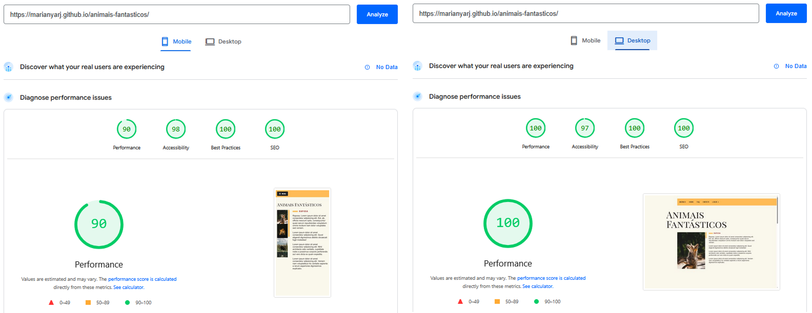
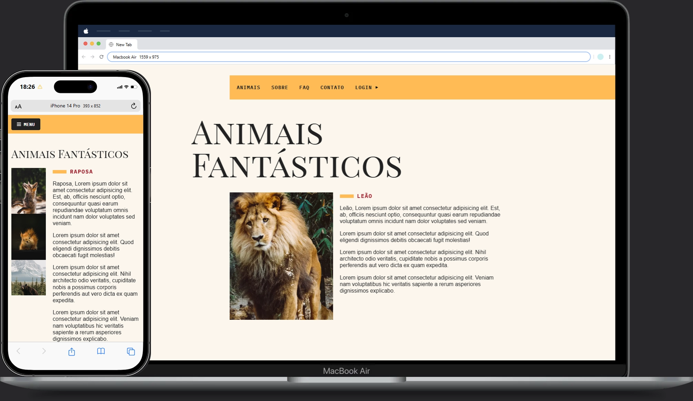

# Animais Fantásticos

[English](#english) | [Español](#español) | [Português](#português)

---

## English

Animal Fantasy is a web application with dynamic information about animals.

### Description
Project built with Vanilla JavaScript, focused on DOM manipulation, local JSON data fetching, semantic HTML, and accessibility.

### Features
- Responsive menu
- Tabs navigation
- FAQ accordion
- Image slider
- Login modal
- Scroll animations

### Tech Stack
- HTML5
- CSS3
- JavaScript (ES6+)
- Webpack
- Babel
- JSON (local data)

### Build Tools
- Webpack (development and production mode)
- Babel (ES6+ compatibility)

### Accessibility & SEO & Performance
- Semantic structure (nav, section, footer)
- Proper heading hierarchy
- Alt attributes on images
- ARIA usage in mobile menu
- Meta description
- Optimized and resized images
- WebP format
- Reduced asset size

### Responsiveness
- CSS Grid layout
- Mobile-friendly design with media queries

---

## Español

Animales Fantásticos es una aplicación web con información dinámica sobre animales.

### Descripción
Proyecto desarrollado con JavaScript Vanilla, enfocado en manipulación del DOM, consumo de datos JSON locales, HTML semántico y accesibilidad.

### Funcionalidades
- Menú responsivo
- Navegación por pestañas
- Acordeón en FAQ
- Slider de imágenes
- Modal de login
- Animaciones al hacer scroll

### Tecnologías
- HTML5
- CSS3
- JavaScript (ES6+)
- Webpack
- Babel
- JSON (datos locales)

### Herramientas de build
- Webpack (modo desarrollo y producción)
- Babel (compatibilidad ES6+)

### Accesibilidad & SEO & Rendimiento
- Estructura semántica
- Jerarquía de headings
- Uso de alt en imágenes
- ARIA en menú móvil
- Meta description
- Imágenes optimizadas y redimensionadas
- Formato WebP

### Responsividad
- CSS Grid
- Diseño adaptado a dispositivos móviles

---

## Português

Animais Fantásticos é uma aplicação web com informações dinâmicas sobre animais.

### Descrição
Projeto desenvolvido com JavaScript Vanilla, focado em manipulação do DOM, consumo de dados via JSON local, HTML semântico e acessibilidade.

### Funcionalidades
- Menu responsivo
- Navegação por tabs
- Accordion no FAQ
- Slider de imagens
- Modal de login
- Animações ao scroll

### Tech Stack
- HTML5
- CSS3
- JavaScript (ES6+)
- Webpack
- Babel
- JSON (dados locais)

### Build Tools
- Webpack (modo desenvolvimento e produção)
- Babel (compatibilidade ES6+)

### Acessibilidade, SEO e Performance
- Estrutura semântica (nav, section, footer)
- Hierarquia correta de headings
- Uso de alt em imagens
- ARIA no menu mobile
- Meta description
- Imagens otimizadas e redimensionadas
- Uso de WebP
- Melhor tempo de carregamento

### Responsividade
- CSS Grid
- Layout adaptado para dispositivos móveis

---

Built for learning purposes and continuous practice in software development.